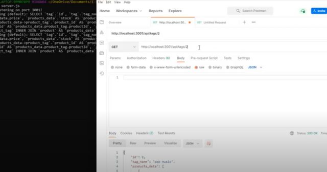

# E-COMMERCE 🛒💳

## Description 
For this assignment we will be focusing on the back-end of a e-commerce application. We will be configuring a working Express.js API and use Sequalize to interact with a MySQL database. This will help us to better understand the fundamentals of other similar e-commerce platforms.

## User Story
A manager at an internet retail company wants a back end for their e-commerce website that uses the latest technologies so that their company can compete with other e-commerce companies.

## Directions 
To test my application:
- After entering schema and seed commands, a database is created and the data is seeded. 
- Then entering 'node server.js' to start port listening.
- Next would be to run Postman with created routes and data will be displayed. 
- When creating, updating, or deleting data it is done sucessfully.

## Acceptance Criteria 
- Given a functional Express.js API
- When adding database name, MySQL username, and MySQL password to an environment variable file
- Then user is able to connect to a database using Sequelize
- When entering schema and seed commands
- Then a development database is created and is seeded with test data
- When entering the command to invoke the application
- Then server is started and the Sequelize models are synced to the MySQL database
- When opening API GET routes in Postman for categories, products, or tags
- Then the data for each of these routes is displayed in a formatted JSON
- When testing API POST, PUT, and DELETE routes in Postman
- Then are able to successfully create, update, and delete data in my database

## Tools and Technologies
- Express.js
- API
- MySQL
- Sequalize
- Postman

## Usage 
> **To view how my application runs**: visit deployed [Link](https://drive.google.com/file/d/1Tc8hE1-iWI8ws5vFQmybc7VfAy9vlMAQ/view?usp=sharing)

## Mock Up

